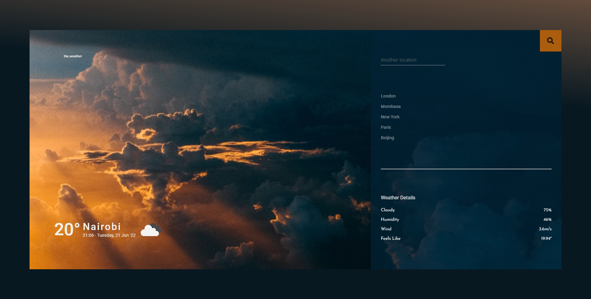

# Weather App

## By Maurice Nganga

[Blog](https://medium.com/@mauricenganga41/weather-app-d714df90b90e)

## Weather App

## Table of Content

- [Description](#description)
- [Features](#features)
- [Development](#development)
- [Live Link](#live-link)
- [Setup Instructions and Technology](#technology-used)
- [License](#license)

## Description

---

At phase 0 in Software Development course we covered the intoduction to _**HTML**_, _**CSS**_, and _**JavaScript**_. _**HTML**_ is used for structure of the webpages and _**CSS**_ is for adding styles to the page. _**JavaScript**_ allows the interaction with the page and adds functonality to it.
With the help of the three, I was able to make a weather aplication that fetches the global weather data and displaying on the page.

The first part of the project, the _**HTML**_ involved creating a simple structure which included making a landing section that will contain a title section which would be on the left side of the page and weather information section on the right side of the page. In the title section is where the city name, date, temperature and weather icon would be displayed when selected. The information section is where it would hold the specific descriptive information about the weather including humidity, cloud cover, wind speed and temperature.

The second stage was to add _**CSS**_ styling to the html that was made. It included adding a background color to the landing page container using liner gradient, addition of background image to the title section and added a font styling that made the fonts on the page look appealing to the user. I added some hover effects to the sumit button and the cities section of the landing page, that adds a nice effect on the elemnents.

The third part was to use _**JavaScript**_ to add functionalities that would manipulate the Weather App website. I first defined a function, _init_, that when the browser loads it will involke it. The function then calls on, _fetchWeatherData_ function that gets data from [openweathermap](https://openweathermap.org/) using an fetch method and url passed to it. The respose of that fecth method is then passed to, _uploadWeather_ function that now targets the html page and populates it with the response data. The defaut and first weather data that is passed to the browser is the weather information of Nairobi city.

The next thing was to target the _form_ element in the html and add an event listner to it that will enable a user to input and submit their request and be able to get back their result. The event the form was listening to was _submit_ in the callback function the input value was able to be passed on to the _uploadWeather_ function. The result gotten back from the form submit was displayed at the main containder replacing the default data of Nairobi city.

A _click_ event was added to the cities on the left side at the information section. When any of the cities were clicked they triggered the _fetchWeatherData_ fucntion that was passed in as a callback function, and the weather details of individula city is displayed in the main container.

I then went a head and made a _calculateDate_ function that will calculate and return the present year, month, day, hours and minutes that I then used to display on the landing page.

A _onMouseOver_ function was defined that will listen when the _mouseover_ event was triggered on the page when a user moved their mouse over the city name in the main container and this will then display additional weather discription of that city.

## Features

---

A user visiting this page would be able to see:

1. A weather app landing page with the weather of Nairobi city

2. The current time and date on the landing page

3. List of major world cities they can select to see the current weather there

4. An input field that they can search location they want weather informaton on

5. A submit button to be able to get the weather result their input

6. Their result back of the weather displayed in the main container of the landing page

### Technology Used

---

- Used Visual Studio Code editor to write the _**HTML**_, _**CSS**_ and _**Javascript**_ used to create the quiz board website.

- **HTML** - HTML was used to create the structure and foundation of the landing page.

- **CSS** - used css to style the website to look appealing to the user.

- **Javascript** - Used Javascript to create functions, conditions and loops to manipulate items on the webpage. Especially added event listeners that can listen and trigger a function when features like form submit, mouseover and button are triggered.

- Employed the help of [www.w3schools.com](https://www.w3schools.com/jsref/prop_element_classlist.asp) to be able to add and remove class attributes. With the help of [stackoverflow.com](https://stackoverflow.com/questions/9709209/html-select-only-one-checkbox-in-a-group) I was able to add the function to allow only one answer to be selcted at a time.

- Used [rapidapi](https://rapidapi.com/hub) to get the [openweathermap](https://openweathermap.org/) API keys that enabled me to fetch and use their APIs to create the weather app

---

## Development

---

Want to contribute? Excellent!

To enhance or contribute on the existing project, follow these steps:

- Fork the repo
- Create a new branch (git checkout -b enhance-feature)
- Make the appropriate changes in the files
- Add changes to reflect the changes made
- Commit your changes (git commit -m 'enhanced feature')
- Push to the branch (git push origin enhance-feature)
- Create a Pull Request

### Live Link

---

\- Click this link to see the live website [Weather App Website](https://moryno.github.io/WeatherApp-Project/)

## License

---

MIT License

Copyright (c) [2022] [Maurice Nganga]

Permission is hereby granted, free of charge, to any person obtaining a copy
of this software and associated documentation files (the "Software"), to deal
in the Software without restriction, including without limitation the rights
to use, copy, modify, merge, publish, distribute, sublicense, and/or sell
copies of the Software, and to permit persons to whom the Software is
furnished to do so, subject to the following conditions:

The above copyright notice and this permission notice shall be included in all
copies or substantial portions of the Software.

THE SOFTWARE IS PROVIDED "AS IS", WITHOUT WARRANTY OF ANY KIND, EXPRESS OR
IMPLIED, INCLUDING BUT NOT LIMITED TO THE WARRANTIES OF MERCHANTABILITY,
FITNESS FOR A PARTICULAR PURPOSE AND NONINFRINGEMENT. IN NO EVENT SHALL THE
AUTHORS OR COPYRIGHT HOLDERS BE LIABLE FOR ANY CLAIM, DAMAGES OR OTHER
LIABILITY, WHETHER IN AN ACTION OF CONTRACT, TORT OR OTHERWISE, ARISING FROM,
OUT OF OR IN CONNECTION WITH THE SOFTWARE OR THE USE OR OTHER DEALINGS IN THE
SOFTWARE.
